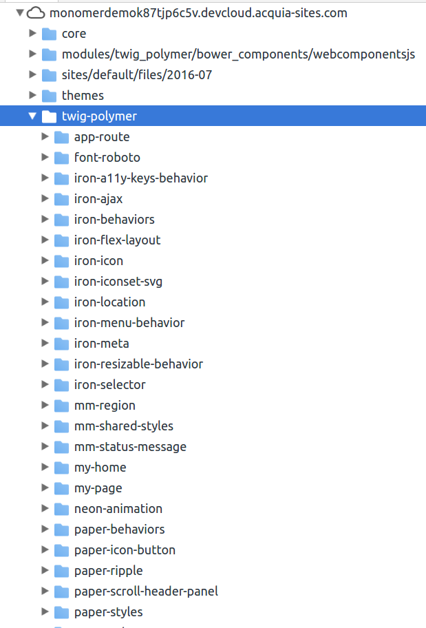

# Twig Polymer Extension for Drupal 8
Making it easier to use Polymer elements in Drupal's Twig templates.

## Status
This module is **put on hold** as the author is focused on [Web Components Renderer](http://github.com/ztl8702/wcr).

## Table of contents
<!-- START doctoc generated TOC please keep comment here to allow auto update -->
<!-- DON'T EDIT THIS SECTION, INSTEAD RE-RUN doctoc TO UPDATE -->


- [What problem does it solve?](#what-problem-does-it-solve)
- [Installation](#installation)
- [Features](#features)
  - [Polymer endpoint](#polymer-endpoint)
    - [Usage](#usage)
  - [Unified Virtual Component Registry](#unified-virtual-component-registry)
  - [Twig functions and helpers](#twig-functions-and-helpers)
    - [Usage](#usage-1)
  - [Drupal Console command](#drupal-console-command)
    - [Usage](#usage-2)

<!-- END doctoc generated TOC please keep comment here to allow auto update -->

## What problem does it solve?
When using Polymer elements, we need a static server to serve the files (`polymer.html`, `paper-button.html`, `your-custom-element.html`, etc.) You may put them in a static folder of your website, but that is hard to manage and you need to write awkwardly long URL in your templates to reference. Also, you cannot use relative URLs for your Polymer elements. (`<link rel='import' href="../polymer/polymer.html">` means different files on `/`, `/node/2`, `/taxonomy/10`)

Twig Polymer Extension allows you to keep all the Polymer elements (both downloaded and your custom ones) you use in your theme folder, using Bower to manage dependencies so that they can be tracked in Git/SVN. It adheres to Polymer's [element package layout](https://www.polymer-project.org/1.0/docs/tools/polymer-cli#element-project-layout) so all dependencies between Polymer elements will not break. This module also provides a simple Twig helper that you can use to reference your Polymer elements without figuring out what the URL should be.

## Installation
 - Instal node.js and bower globally on your machine.
 - Download this module.
 - Run `bower install` in the module folder. 
 - Enable this module. 

## Features
### Polymer endpoint
 * Provides an endpoint for serving Polymer elements (equivalent to `poly-serve`).
   - Access your elements : `\twig-polymer\{element-relative-path}`. e.g. `http://localhost/twig-polymer/paper-button/paper-button.html`. Defaults to current theme, fallback to base themes.
   - Theme Fallback
     - If an element is not found in a theme, its parent themes are searched. If still not found, the global library folder will be searched. For details of the priority of element discovery, see: https://github.com/ztl8702/twig_polymer/blob/dev/src/Util/ElementDiscovery.php#L58
     - This allows common elements to be shared among your themes.

#### Usage
  - In your theme folder, first run `bower init`, then run `bower install --save your-desired-element` to install 3rd party Polymer elements you like.
  - In your theme folder, place your custom elements in `/my-elements` folder. `/bower_components` and `/my-elements` folder will be "virtually combined" to allow seamless access to both custom and 3rd party elements. 
  - Optional: add `bower_components` to your `.gitignore` file.

> Note: Always use relative URL in your elements. See [Polymer documentation](https://www.polymer-project.org/1.0/docs/tools/polymer-cli#element-project-layout) for more.  

### Unified Virtual Component Registry
A single registry containing all components from all themes, either 3rd party or custom-built.

Suppose we have a base theme and a sub-theme.

```
base-theme                                    sub-theme
├── base-theme.info.yml                       ├── sub-theme.info.yml
├── bower_components                          ├── bower_components
│   ├── polymer                               │   ├── echo-html
│   │   └── polymer.html                      │   │   └── echo-html.html
│   └── neon-animations                       │   └── paper-fab
|      └── neon-animations.html               |      └── paper-fab.html
├── my-elements                               ├── my-elements
|   ├── my-region                             |   ├── my-block
|   |   ├── my-region.html                    |   |   └── my-block.html 
|   |   └── my-region-styles.html             |   └── ...
|   └── ...                                   └── templates
└── templates
```

The `/twig-polymer/` [endpoint](#polymer-endpoint) will give you access to all of the components in all themes as if they were in a unified registry. 
```
\twig-polymer
├── polymer
│   └── polymer.html
├── neon-animations
│   └── neon-animations.htmlb
├── my-region
|   ├── my-region.html   
|   └── my-region-styles.html 
├── echo-html   
│   └── echo-html.html
├── paper-fab
|   └── paper-fab.html           
└── my-block
    └── my-block.html
```

> Conflict resolution: sub themes have greater priority and they override what is in the base theme.  Custom built elements (`my-elements`)
> has greater priority over 3rd party elements (`bower_components`). This rule applies **recursively**. 



### Twig functions and helpers
 - `` is a shortcut for **HTML import `<link>` elements**.
 - `polymer_render_var()` renders a variable / render array and replaces all placeholders. (Used for )

#### Usage
 - `` will generate:
```twig
<link rel="import" href="/twig-polymer/paper-button/paper-button.html">
```
> Do NOT put `bower_components` or `my-elements` in the path. Don't worry, relative URLs and "3rd party vs. custom element directories" are automatically handled.
> 
> You always access any element using "{package-name}/{element-name}.html".
 
### Drupal Console command 
`polymer:element` generates boilerplate code for your elements.

#### Usage
```bash
> drupal polymer:element --theme YOUR_THEME --package your-element-package --element your-element [--create-style]
```
